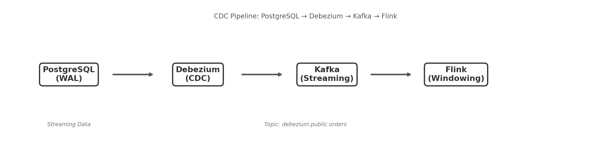

# CDC Pipeline: PostgreSQL - Debezium - Kafka - Flink

This project sets up a Change Data Capture (CDC) pipeline that streams data changes from PostgreSQL to Kafka using Debezium, and processes them in real-time with Apache Flink using windowed aggregations.

## Project Overview

The setup includes:
- **PostgreSQL**: The source database where data changes are captured.
- **Debezium**: A CDC tool that captures changes from PostgreSQL and publishes them to Kafka.
- **Kafka**: Acts as the data streaming platform, receiving and holding data from Debezium for downstream consumers.
- **Flink**: Stream processing engine that consumes events from Kafka and applies windowed aggregations.

## Architecture Diagram

Below is a visual representation of the CDC pipeline:



## Quickstart Commands

1. **Build and start the Docker Containers**

   Build the custom Flink image and bring up all services (PostgreSQL, Kafka, Zookeeper, Debezium, Kafka UI, and Flink):

   ```bash
   docker compose build
   docker compose up -d
   ```

2. **Configure the Debezium Connector**

    After starting the services, configure the Debezium connector with the following command. Make sure you have `connector.json` configured with your desired settings for the connector.

    ```bash
    curl -X POST -H "Content-Type: application/json" --data @connector.json http://localhost:8083/connectors
    ```

    This will initialize the CDC pipeline, with data changes from PostgreSQL being streamed to Kafka.

3. **Create the orders table and insert sample data**

    ```bash
    docker compose exec postgres psql -U postgres -c "
    CREATE TABLE orders (
      id SERIAL PRIMARY KEY,
      customer_name VARCHAR(100),
      product VARCHAR(100),
      quantity INT,
      total DECIMAL(10,2),
      status VARCHAR(20) DEFAULT 'pending',
      created_at TIMESTAMP DEFAULT now()
    );

    INSERT INTO orders (customer_name, product, quantity, total) VALUES
      ('Juan', 'Laptop', 1, 1500.00),
      ('Maria', 'Mouse', 2, 50.00),
      ('Pedro', 'Teclado', 1, 80.00);
    "
    ```

4. **Submit the Flink job**

    ```bash
    docker compose exec flink-jobmanager ./bin/flink run -py /opt/flink/src/consumer.py
    ```

    The job will appear in the Flink UI at `http://localhost:8081`.

5. **Watch the Flink output**

    ```bash
    docker compose logs -f flink-taskmanager
    ```

6. **Generate new events**

    Insert, update or delete rows in PostgreSQL to see them processed by Flink:

    ```bash
    docker compose exec postgres psql -U postgres -c \
      "INSERT INTO orders (customer_name, product, quantity, total) VALUES ('Ana', 'Monitor', 1, 300.00);"
    ```

